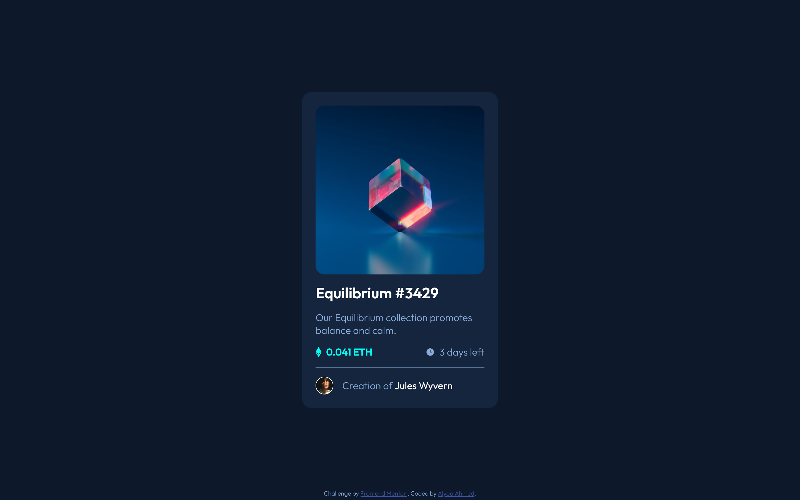
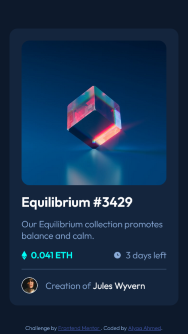

# Frontend Mentor - NFT preview card component solution

This is a solution to the [NFT preview card component challenge on Frontend Mentor](https://www.frontendmentor.io/challenges/nft-preview-card-component-SbdUL_w0U). Frontend Mentor challenges help you improve your coding skills by building realistic projects.

## Table of contents

- [Frontend Mentor - NFT preview card component solution](#frontend-mentor---nft-preview-card-component-solution)
  - [Table of contents](#table-of-contents)
  - [Overview](#overview)
    - [The challenge](#the-challenge)
    - [Screenshot](#screenshot)
    - [Links](#links)
  - [My process](#my-process)
    - [Built with](#built-with)
    - [What I learned](#what-i-learned)
    - [Useful resources](#useful-resources)
  - [Author](#author)

**Note: Delete this note and update the table of contents based on what sections you keep.**

## Overview

### The challenge

Users should be able to:

- View the optimal layout depending on their device's screen size
- See hover states for interactive elements

### Screenshot





### Links

- Solution URL: [Add solution URL here](https://your-solution-url.com)
- Live Site URL: [Netlify](https://soft-sherbet-7fb3d7.netlify.app/)

## My process

### Built with

- Semantic HTML5 markup
- CSS custom properties
- Flexbox
- Mobile-first workflow

### What I learned

Adding an overlay color th the card image was challanging, here's how it was finally resolved. the concept itself is relatively easy.

```css
.card__image-container {
  position: relative;
  border-radius: 1rem;
  overflow: hidden;
}
.card__img {
  width: 100%;
  height: auto;
}
.card-img--overlay {
  display: none;
  position: absolute;
  background-color: hsla(178, 100%, 50%, 0.5);
  width: 100%;
  height: 100%;
  top: 0;
}
.card__image-container:hover .card-img--overlay,
.card__image-container:focus .card-img--overlay {
  cursor: pointer;
  display: flex;
  justify-content: center;
  align-items: center;
}
```

### Useful resources

- [Overlay Color](https://stackoverflow.com/questions/65724907/adding-an-overlay-color-on-hover-to-a-background-image)

## Author

- Frontend Mentor - [@AlyaaRushdy](https://www.frontendmentor.io/profile/AlyaaRushdy)
- Linkedin - [Alyaa Ahmed](https://www.linkedin.com/in/alyaa-ahmed/)
